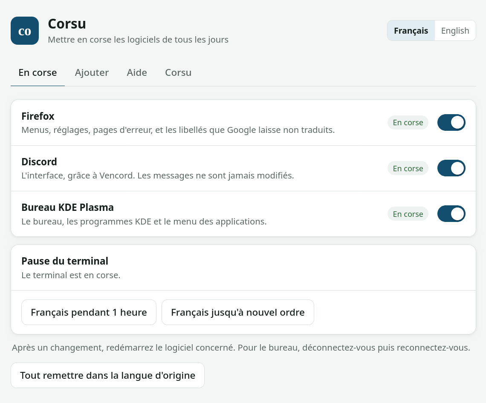
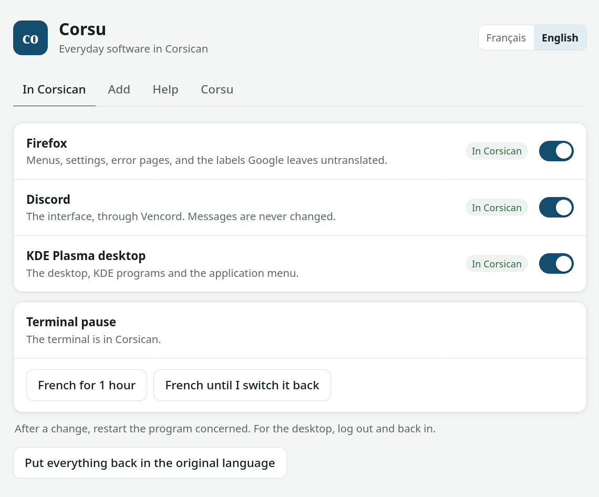

# Corsu

**[Français](#français) · [English](#english)**

Corsu met en corse les logiciels de tous les jours. Corsu puts everyday software in Corsican.

---

## Français

Corsu met en corse les menus et les réglages de Firefox, Chrome, Opera GX et Discord, ainsi que le bureau KDE Plasma
et les commandes du terminal sous Linux. Il fonctionne sous Windows, macOS et Linux, et chaque partie peut être
désactivée puis réactivée à tout moment.

### Pourquoi Corsu

Apprendre une langue, savoir la parler et avoir des occasions de s'en servir sont trois choses différentes.
Beaucoup de Corses, surtout sur la côte et en ville, n'ont pas d'endroit où pratiquer le corse en dehors de l'école,
alors que ce sont eux qui passent le plus de temps en ligne. Et de nombreux locuteurs ne parlent pas corse parce que
la langue leur semble décalée dans le contexte où ils se trouvent.

L'irlandais montre cet écart : au recensement de 2022, 1 873 997 personnes en République d'Irlande déclaraient savoir
le parler, mais 71 968 seulement le parlaient tous les jours en dehors du système éducatif
([CSO, recensement 2022](https://www.cso.ie/en/releasesandpublications/ep/p-cpp8/censusofpopulation2022profile8-theirishlanguageandeducation/irishlanguageandthegaeltacht/)).

Corsu a deux objectifs :

1. **Rendre le corse familier au quotidien**, en le faisant rencontrer dans les interfaces qu'on utilise tous les
   jours. Cet apprentissage passif complète les cours et la conversation.
2. **Donner au corse plus d'endroits où il paraît naturel**, à commencer par les ordinateurs et les téléphones, pour
   qu'il devienne une langue normale pour s'exprimer en ligne.

Une interface traduite ne remplace pas les échanges entre locuteurs. Pour pratiquer le corse et progresser, même sans
personne à qui le parler :

- [Sapienzia](https://www.sapienzia.io) : traduction, dictionnaire, conjugaison et assistant de conversation en corse ;
- [Astutu](https://astutu.corsica) : assistant qui répond en corse ;
- [LIV](https://liv.corsica) : une intelligence artificielle qui parle corse.

La version longue : [Pourquoi Corsu](docs/fr/pourquoi-corsu.md).

### Installer sur un ordinateur

| Système | Téléchargement | Ensuite | Guide |
| --- | --- | --- | --- |
| Windows | [corsu-windows.zip](https://github.com/Platykalt/corsu/releases/latest/download/corsu-windows.zip) | décompresser, double-cliquer sur `Install for Windows.cmd` | [Windows](docs/fr/ordinateur/windows.md) |
| macOS | [corsu-macos.tar.gz](https://github.com/Platykalt/corsu/releases/latest/download/corsu-macos.tar.gz) | double-cliquer sur `Install for macOS.command` | [macOS](docs/fr/ordinateur/macos.md) |
| Linux | [corsu-linux.tar.gz](https://github.com/Platykalt/corsu/releases/latest/download/corsu-linux.tar.gz) | lancer `./"Install for Linux.sh"` | [Linux](docs/fr/ordinateur/linux.md) |

Ou en une ligne, dans PowerShell sous Windows : `irm https://raw.githubusercontent.com/Platykalt/corsu/main/install/get.ps1 | iex`
Dans le Terminal sous macOS ou Linux : `curl -fsSL https://raw.githubusercontent.com/Platykalt/corsu/main/install/get.sh | sh`

L'application Corsu s'ouvre dans sa fenêtre avec les logiciels trouvés, tous cochés. Elle montre ce qui va
changer avant de le faire, et Corsu garde une copie de chaque fichier modifié. Rouvrez-la ensuite depuis le menu des
applications pour ajouter un logiciel, remettre une partie dans sa langue d'origine (le terminal pendant une heure,
par exemple) ou tout retirer.

Discord : réglez sa langue sur Français ou English, voir [Discord en corse](docs/fr/discord.md).
Google en corse : choisissez Corsu dans la langue de votre compte Google, voir [ce guide](docs/fr/compatibilite.md#google-et-les-autres-sites). Dans Firefox Corsu, les boutons que Google laisse en français ou en anglais sont complétés en corse.
Téléphones : [Android](docs/fr/telephone/android.md), [iPhone](docs/fr/telephone/iphone.md). Prédiction et correction des mots corses pour le clavier Keyman : [corsu-keyboard.kmp](https://github.com/Platykalt/corsu/releases/latest/download/corsu-keyboard.kmp).
Ce qui est vérifié et ce qui est seulement prévu : [Ce qui marche, et où](docs/fr/compatibilite.md).

### Les traductions

Corsu compte environ 132 000 phrases traduites. Plus de 16 000 viennent d'autres logiciels libres, traduits pour la
plupart par Patriccollu di Santa Maria è Sichè (Firefox pour Android et iOS, Thunderbird, VLC, Audacity, HandBrake,
Notepad++, Poedit, WinMerge, Tenacity, OpenTracks…). Les autres ont été écrites pour Corsu avec le même vocabulaire,
dont environ 20 000 pour Discord et Vencord. Une traduction vous paraît fausse ?
[Ouvrez un ticket](https://github.com/Platykalt/corsu/issues/new?template=translation.yml) ou voyez
[CONTRIBUTING.md](CONTRIBUTING.md).

Pour aller plus loin : [toute la documentation](docs/README.md), [ce que Corsu modifie](docs/fr/ce-que-corsu-modifie.md),
[développement](docs/fr/developpeurs.md), [sécurité](SECURITY.md), [CHANGELOG.md](CHANGELOG.md).

---

## English

Corsu puts the menus and settings of Firefox, Chrome, Opera GX and Discord in Corsican, and on Linux also the KDE
Plasma desktop and terminal commands. It works on Windows, macOS and Linux, and each part can be switched off and on
again at any time.

### Why Corsu

Learning a language, being able to speak it and having occasions to use it are three different things. Many
Corsicans, especially on the coast and in towns, have nowhere to practise Corsican outside school, while they are the
people who spend the most time online. And many speakers do not use Corsican because it feels out of place in the
situations they are in.

Irish shows the gap: in the 2022 census, 1,873,997 people in the Republic of Ireland said they could speak it, but
only 71,968 spoke it every day outside the education system ([CSO, Census 2022](https://www.cso.ie/en/releasesandpublications/ep/p-cpp8/censusofpopulation2022profile8-theirishlanguageandeducation/irishlanguageandthegaeltacht/)).

Corsu has two goals:

1. **Make Corsican familiar every day**, by meeting it in the interfaces people use daily. This passive learning adds
   to lessons and conversation.
2. **Give Corsican more places where it feels natural**, starting with computers and phones, so that it becomes a
   normal language to express yourself online.

A translated interface does not replace talking with other speakers. To practise Corsican and improve, even with
nobody around to speak it with:

- [Sapienzia](https://www.sapienzia.io): translation, dictionary, conjugation and a conversation assistant in Corsican;
- [Astutu](https://astutu.corsica): an assistant that answers in Corsican;
- [LIV](https://liv.corsica): an artificial intelligence that speaks Corsican.

The long version: [Why Corsu](docs/en/why-corsu.md).

### Install on a computer

| System | Download | Then | Guide |
| --- | --- | --- | --- |
| Windows | [corsu-windows.zip](https://github.com/Platykalt/corsu/releases/latest/download/corsu-windows.zip) | extract it, double-click `Install for Windows.cmd` | [Windows](docs/en/computer/windows.md) |
| macOS | [corsu-macos.tar.gz](https://github.com/Platykalt/corsu/releases/latest/download/corsu-macos.tar.gz) | double-click `Install for macOS.command` | [macOS](docs/en/computer/macos.md) |
| Linux | [corsu-linux.tar.gz](https://github.com/Platykalt/corsu/releases/latest/download/corsu-linux.tar.gz) | run `./"Install for Linux.sh"` | [Linux](docs/en/computer/linux.md) |

Or in one line, in PowerShell on Windows: `irm https://raw.githubusercontent.com/Platykalt/corsu/main/install/get.ps1 | iex`
In Terminal on macOS or Linux: `curl -fsSL https://raw.githubusercontent.com/Platykalt/corsu/main/install/get.sh | sh`

The Corsu app opens in its own window with the programs found, all ticked. It shows what will change before
doing it, and Corsu keeps a copy of every file it changes. Open it again from the applications menu to add a program,
put a part back in its original language (the terminal for an hour, for example) or remove everything.

Discord: set its language to Français or English, see [Discord in Corsican](docs/en/discord.md).
Google in Corsican: choose Corsu as your Google account language, see [this guide](docs/en/compatibility.md#google-and-other-websites). In Firefox Corsu, the buttons Google leaves in French or English are completed in Corsican.
Phones: [Android](docs/en/phone/android.md), [iPhone](docs/en/phone/iphone.md). Corsican word prediction and correction for the Keyman keyboard: [corsu-keyboard.kmp](https://github.com/Platykalt/corsu/releases/latest/download/corsu-keyboard.kmp).
What is verified and what is only expected: [What works where](docs/en/compatibility.md).

### Translations

Corsu has about 132,000 translated phrases. More than 16,000 come from other free software, most of them translated
by Patriccollu di Santa Maria è Sichè (Firefox for Android and iOS, Thunderbird, VLC, Audacity, HandBrake, Notepad++,
Poedit, WinMerge, Tenacity, OpenTracks…). The rest were written for Corsu with the same vocabulary, about 20,000 of
them for Discord and Vencord. Does a translation look wrong?
[Open an issue](https://github.com/Platykalt/corsu/issues/new?template=translation.yml) or see
[CONTRIBUTING.md](CONTRIBUTING.md).

More: [all the documentation](docs/README.md), [what Corsu changes](docs/en/what-corsu-changes.md),
[development](docs/en/developers.md), [security](SECURITY.md), [CHANGELOG.md](CHANGELOG.md).

---

Corsu est un logiciel libre sous [licence GNU GPL](LICENSE), version 3 ou ultérieure · Corsu is free software under the
[GNU GPL](LICENSE), version 3 or later. Les traductions reprises d'autres projets gardent leur licence, indiquée dans
[lexicon/](lexicon/) · Translations taken from other projects keep their own license, given in [lexicon/](lexicon/).
